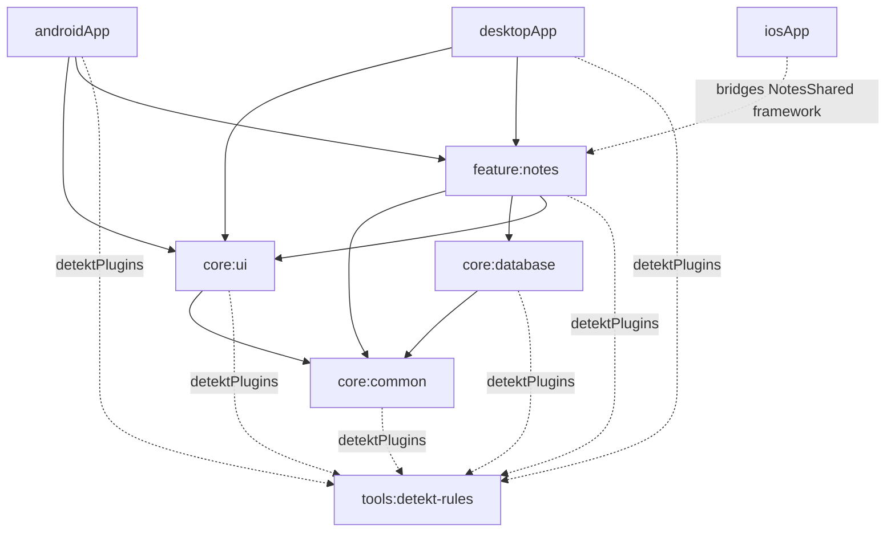

# notes-kmp

## Project Module Diagram

## Module Docs

| Module | README | Architecture |
|---|---|---|
| `androidApp` | [androidApp/README.md](androidApp/README.md) | [androidApp/ARCHITECTURE.md](androidApp/ARCHITECTURE.md) |
| `desktopApp` | [desktopApp/README.md](desktopApp/README.md) | [desktopApp/ARCHITECTURE.md](desktopApp/ARCHITECTURE.md) |
| `iosApp` | [iosApp/README.md](iosApp/README.md) | [iosApp/ARCHITECTURE.md](iosApp/ARCHITECTURE.md) |
| `core:common` | [core/common/README.md](core/common/README.md) | [core/common/ARCHITECTURE.md](core/common/ARCHITECTURE.md) |
| `core:database` | [core/database/README.md](core/database/README.md) | [core/database/ARCHITECTURE.md](core/database/ARCHITECTURE.md) |
| `core:ui` | [core/ui/README.md](core/ui/README.md) | [core/ui/ARCHITECTURE.md](core/ui/ARCHITECTURE.md) |
| `feature:notes` | [feature/notes/README.md](feature/notes/README.md) | [feature/notes/ARCHITECTURE.md](feature/notes/ARCHITECTURE.md) |
| `tools:detekt-rules` | [tools/detekt-rules/README.md](tools/detekt-rules/README.md) | [tools/detekt-rules/ARCHITECTURE.md](tools/detekt-rules/ARCHITECTURE.md) |
