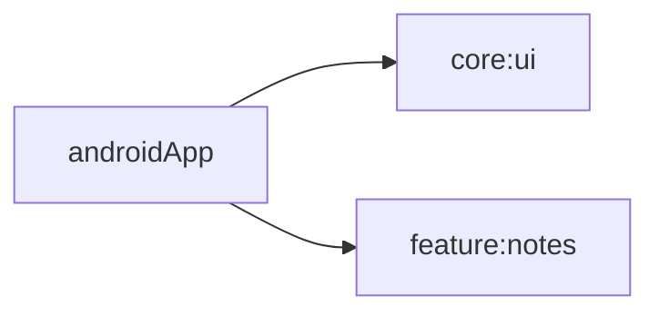
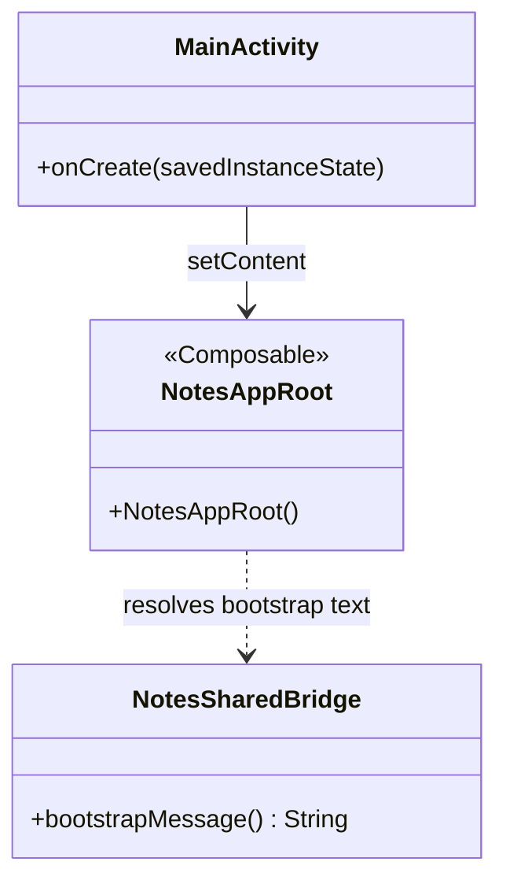
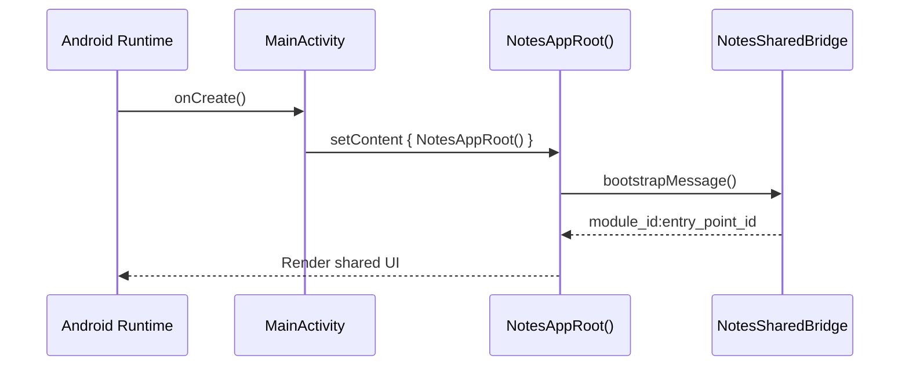

# androidApp Architecture

## Module Dependency Diagram

## Class Diagram

## Sequence Diagram

## Quality Tasks
- Run module formatting with `./gradlew :androidApp:spotlessCheck`.
- Keep entry-point KDoc updated when activity responsibilities change.
