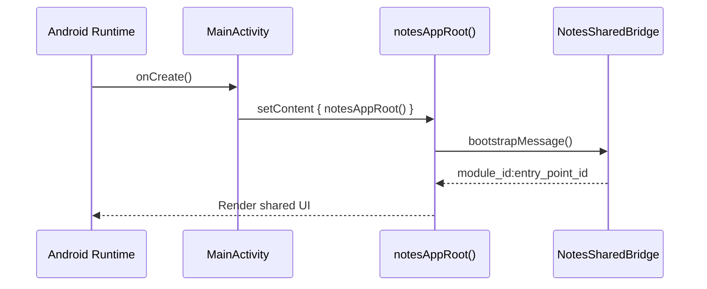

# androidApp Architecture

## Class Diagram

```mermaid
classDiagram
  class MainActivity {
    +onCreate(savedInstanceState)
  }

  class NotesAppRoot {
    <<Composable>>
    +notesAppRoot()
  }

  class NotesSharedBridge {
    +bootstrapMessage() String
  }

  MainActivity --> NotesAppRoot : setContent
  NotesAppRoot ..> NotesSharedBridge : resolves bootstrap text
```

## Sequence Diagram

```mermaid
sequenceDiagram
  participant Android as Android Runtime
  participant Activity as MainActivity
  participant Compose as notesAppRoot()
  participant Bridge as NotesSharedBridge

  Android->>Activity: onCreate()
  Activity->>Compose: setContent { notesAppRoot() }
  Compose->>Bridge: bootstrapMessage()
  Bridge-->>Compose: module_id:entry_point_id
  Compose-->>Android: Render shared UI
```
