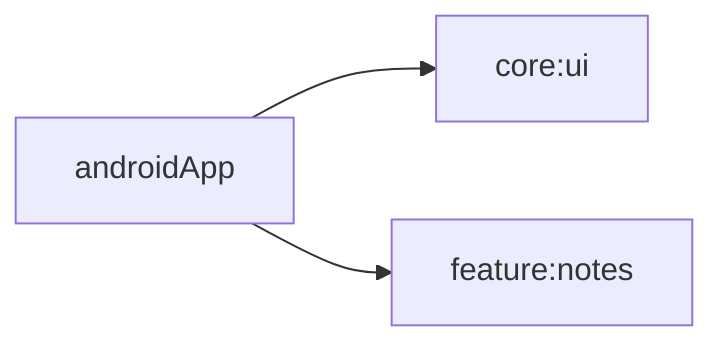

# androidApp

## Purpose
Android entry module for launching the shared notes UI.

## Public Contracts
- `MainActivity`

## Dependencies
- `core:ui`
- `feature:notes`
- `androidx.activity:activity-compose`
- `androidx.core:core-ktx`
- `androidx.appcompat:appcompat`

## Module Dependency Diagram

## Usage Notes
- Build with `./gradlew :androidApp:assembleDebug`.
- `MainActivity` hosts Compose content and renders shared `NotesAppRoot()` UI.
- `MainActivity` includes KDoc describing entry-point responsibilities.
- Module-level format tasks are available: `:androidApp:spotlessCheck` and `:androidApp:spotlessApply`.

## Architecture Docs
- [ARCHITECTURE.md](ARCHITECTURE.md)

## Fake/Mock Notes
- Uses shared modules and can be wired with fake DI modules in later PRs.

## ProGuard/R8 Notes
- No custom rules added in foundation phase.
