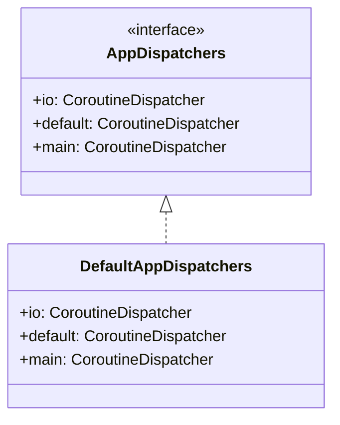
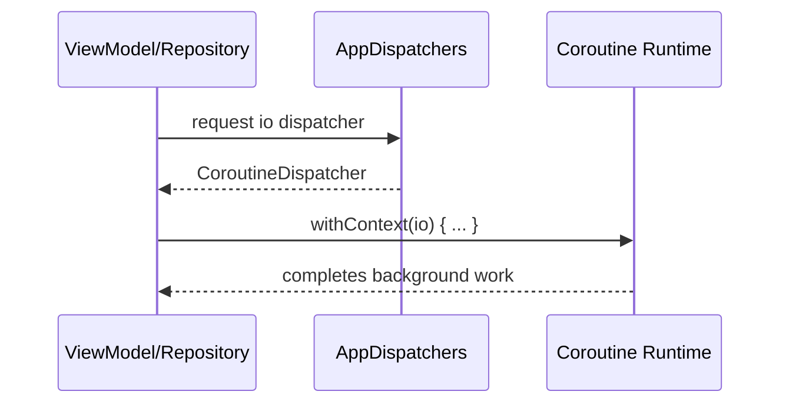

# core:common Architecture

## Class Diagram

```mermaid
classDiagram
  class AppDispatchers {
    <<interface>>
    +io: CoroutineDispatcher
    +default: CoroutineDispatcher
    +main: CoroutineDispatcher
  }

  class DefaultAppDispatchers {
    +io: CoroutineDispatcher
    +default: CoroutineDispatcher
    +main: CoroutineDispatcher
  }

  AppDispatchers <|.. DefaultAppDispatchers
```

## Sequence Diagram

```mermaid
sequenceDiagram
  participant VM as ViewModel/Repository
  participant Dispatchers as AppDispatchers
  participant Coroutine as Coroutine Runtime

  VM->>Dispatchers: request io dispatcher
  Dispatchers-->>VM: CoroutineDispatcher
  VM->>Coroutine: withContext(io) { ... }
  Coroutine-->>VM: completes background work
```

## Quality Tasks
- Run module formatting with `./gradlew :core:common:spotlessCheck`.
