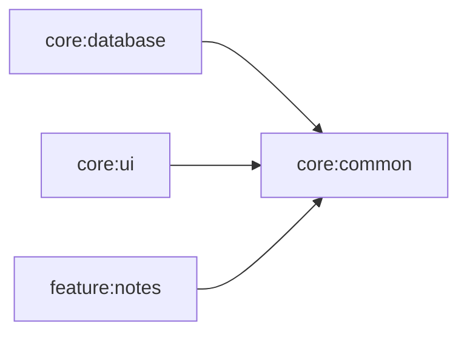

# core:common

## Purpose
Shared cross-module primitives with no feature-specific behavior.

## Public Contracts
- `AppDispatchers`: dispatcher abstraction for IO/default/main dispatchers.
- `DefaultAppDispatchers`: production dispatcher implementation.

## Dependencies
- `kotlinx-coroutines-core`

## Module Dependency Diagram

## Usage Notes
- Inject `AppDispatchers` into repositories and view models instead of hardcoding dispatchers.

## Architecture Docs
- [ARCHITECTURE.md](ARCHITECTURE.md)

## Fake/Mock Notes
- Tests should provide a test implementation of `AppDispatchers` backed by `TestDispatcher`.

## ProGuard/R8 Notes
- N/A (no Android consumer rules in this module yet).
