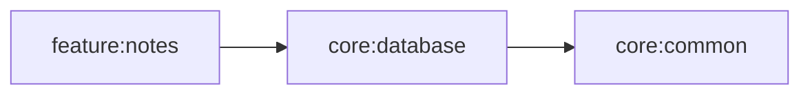
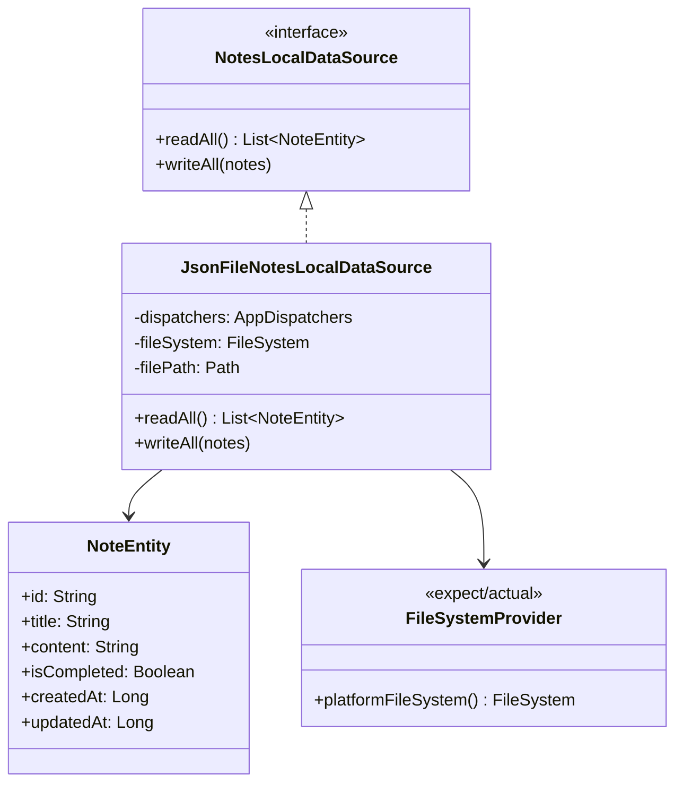
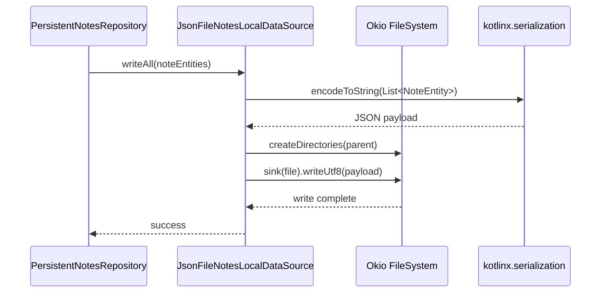

# core:database Architecture

## Module Dependency Diagram

## Class Diagram

## Sequence Diagram

## Quality Tasks
- Run module formatting with `./gradlew :core:database:spotlessCheck`.
- Keep data source contract KDoc synchronized with persistence behavior.
