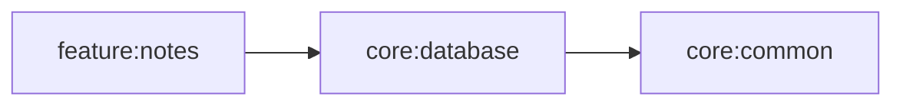

# core:database

## Purpose
Provides local persistence primitives for notes data using a file-backed JSON data source in shared code.

## Public Contracts
- `NoteEntity`: persistence model.
- `NotesLocalDataSource`: local read/write abstraction.
- `JsonFileNotesLocalDataSource`: default JSON file implementation.

## Dependencies
- `core:common`
- `kotlinx-coroutines-core`
- `kotlinx-serialization-json`
- `okio`

## Module Dependency Diagram

## Usage Notes
- Data is stored in `notes-data/notes.json` by default.
- Writes are full snapshot rewrites of the current notes list.

## Architecture Docs
- [ARCHITECTURE.md](ARCHITECTURE.md)

## Fake/Mock Notes
- Tests can provide a fake `NotesLocalDataSource` implementation and override module wiring.

## ProGuard/R8 Notes
- N/A (shared module only).
