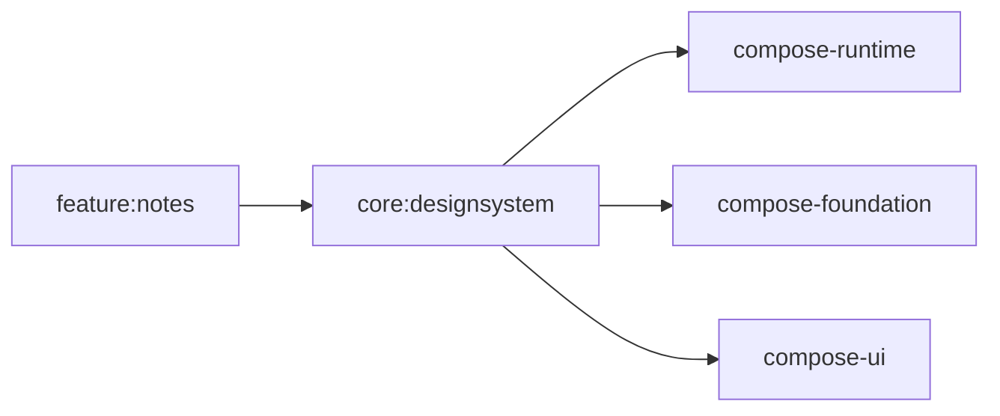
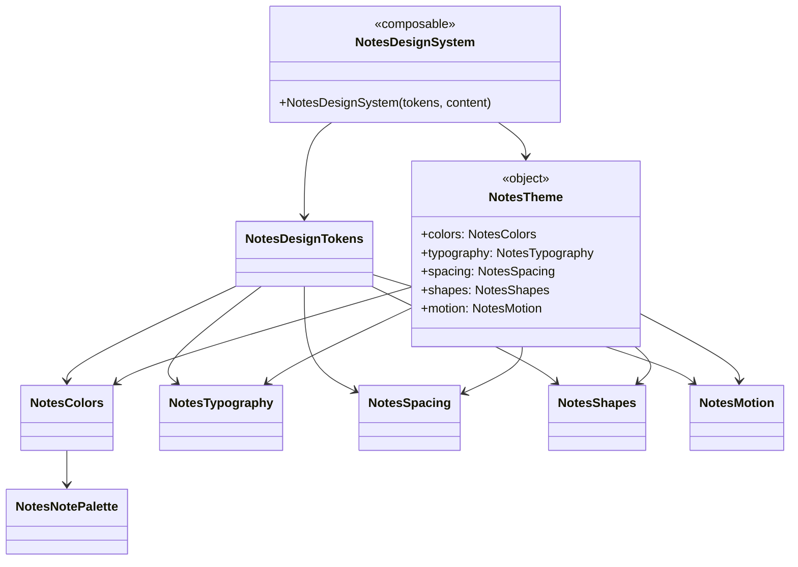
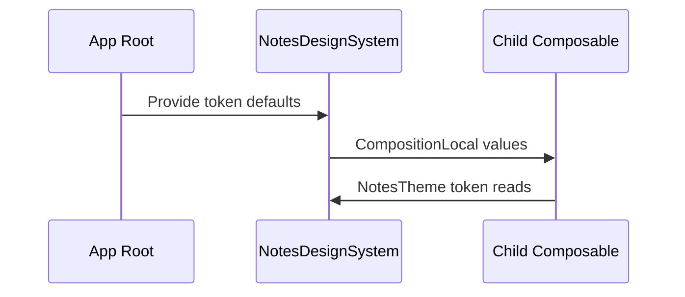

# core:designsystem Architecture

## Module Dependency Diagram

## Class Diagram

## Token Flow

## Quality Tasks
- Run module formatting with `./gradlew :core:designsystem:spotlessCheck`.
- Keep token default tests aligned with color, spacing, shape, typography, and motion changes.
