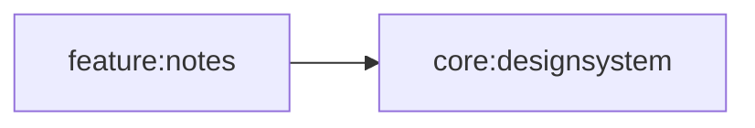

# core:designsystem

## Purpose
Shared Compose Multiplatform design tokens for notes surfaces.

## Public Contracts
- `NotesDesignSystem(content = ...)`
- `NotesTheme.colors`
- `NotesTheme.typography`
- `NotesTheme.spacing`
- `NotesTheme.shapes`
- `NotesTheme.motion`
- Token data types: `NotesColors`, `NotesNotePalette`, `NotesTypography`, `NotesSpacing`, `NotesShapes`, and `NotesMotion`

## Dependencies
- `compose-runtime`
- `compose-foundation`
- `compose-ui`

## Module Dependency Diagram

## Usage Notes
- Wrap app or preview roots with `NotesDesignSystem`.
- Keep this module free of Material3, product state, ViewModels, repositories, and user-facing strings.
- Put reusable components in `core:ui` only after a repeated component need is clear.
- Module-level format tasks are available: `:core:designsystem:spotlessCheck` and `:core:designsystem:spotlessApply`.

## Architecture Docs
- [ARCHITECTURE.md](ARCHITECTURE.md)

## Fake/Mock Notes
- Tests can instantiate token defaults directly.

## ProGuard/R8 Notes
- N/A (shared module only).
