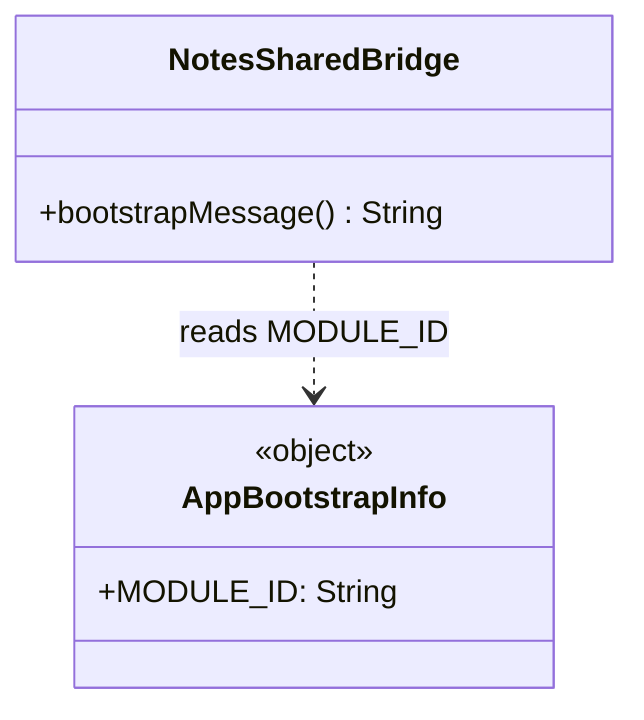
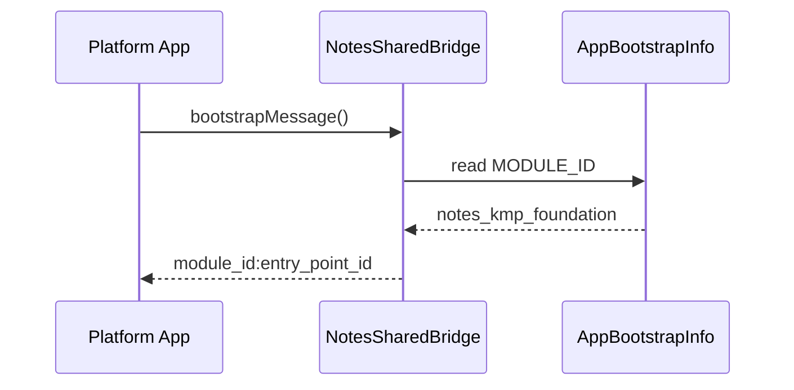

# core:ui Architecture

## Class Diagram

```mermaid
classDiagram
  class AppBootstrapInfo {
    <<object>>
    +MODULE_ID: String
  }

  class NotesSharedBridge {
    +bootstrapMessage() String
  }

  NotesSharedBridge ..> AppBootstrapInfo : reads MODULE_ID
```

## Sequence Diagram

```mermaid
sequenceDiagram
  participant App as Platform App
  participant Bridge as NotesSharedBridge
  participant Bootstrap as AppBootstrapInfo

  App->>Bridge: bootstrapMessage()
  Bridge->>Bootstrap: read MODULE_ID
  Bootstrap-->>Bridge: notes_kmp_foundation
  Bridge-->>App: module_id:entry_point_id
```
