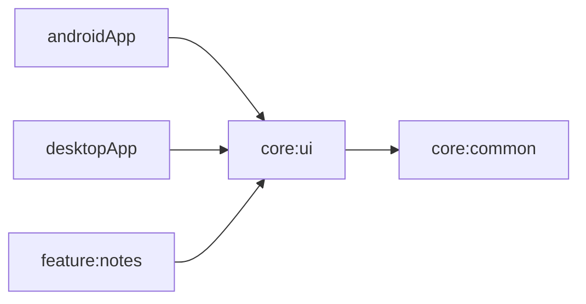

# core:ui

## Purpose
Shared app-level UI bootstrap metadata and cross-platform UI primitives.

## Public Contracts
- `AppBootstrapInfo`

## Dependencies
- `core:common`

## Module Dependency Diagram

## Usage Notes
- Platform apps can use this module to confirm shared app bootstrap wiring.
- Module-level format tasks are available: `:core:ui:spotlessCheck` and `:core:ui:spotlessApply`.

## Architecture Docs
- [ARCHITECTURE.md](ARCHITECTURE.md)

## Fake/Mock Notes
- No external boundary dependencies in this module.

## ProGuard/R8 Notes
- N/A (shared module only).
