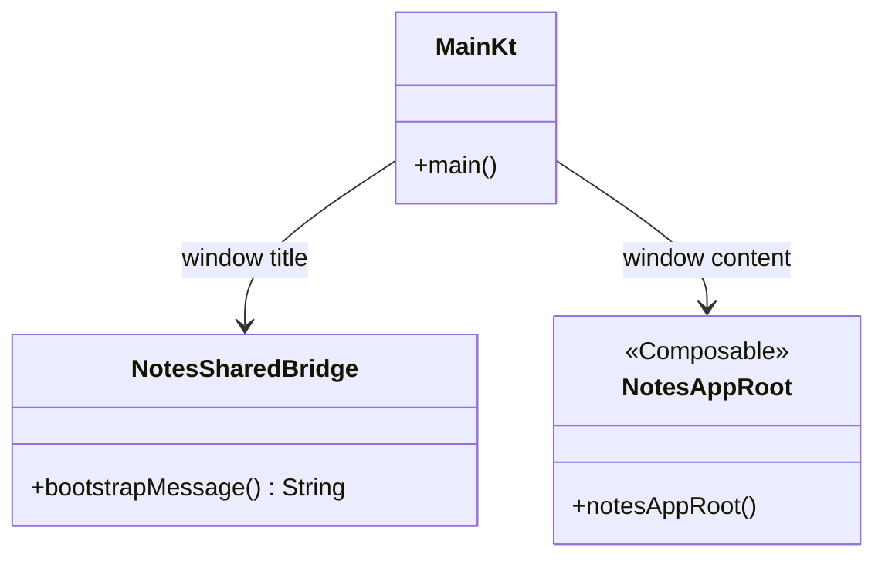
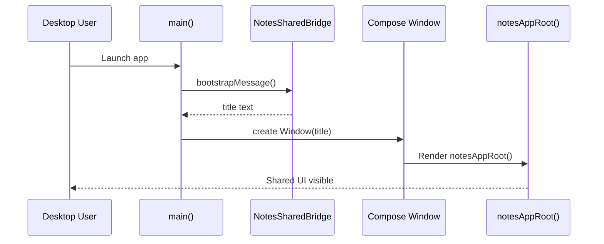

# desktopApp Architecture

## Class Diagram

```mermaid
classDiagram
  class MainKt {
    +main()
  }

  class NotesSharedBridge {
    +bootstrapMessage() String
  }

  class NotesAppRoot {
    <<Composable>>
    +notesAppRoot()
  }

  MainKt --> NotesSharedBridge : window title
  MainKt --> NotesAppRoot : window content
```

## Sequence Diagram

```mermaid
sequenceDiagram
  participant User as Desktop User
  participant Entry as main()
  participant Bridge as NotesSharedBridge
  participant Window as Compose Window
  participant Compose as notesAppRoot()

  User->>Entry: Launch app
  Entry->>Bridge: bootstrapMessage()
  Bridge-->>Entry: title text
  Entry->>Window: create Window(title)
  Window->>Compose: Render notesAppRoot()
  Compose-->>User: Shared UI visible
```
