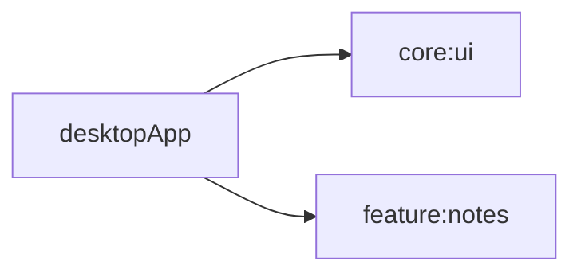

# desktopApp

## Purpose
Desktop JVM entry module for launching the shared notes UI.

## Public Contracts
- `main` entry point in `Main.kt`

## Dependencies
- `core:ui`
- `feature:notes`

## Module Dependency Diagram

## Usage Notes
- Run with `./gradlew :desktopApp:run`.
- Launches a Compose Desktop window and renders shared `NotesAppRoot()` UI.
- Module-level format tasks are available: `:desktopApp:spotlessCheck` and `:desktopApp:spotlessApply`.

## Architecture Docs
- [ARCHITECTURE.md](ARCHITECTURE.md)

## Fake/Mock Notes
- No runtime DI wiring in foundation phase.

## ProGuard/R8 Notes
- N/A for desktop module.
