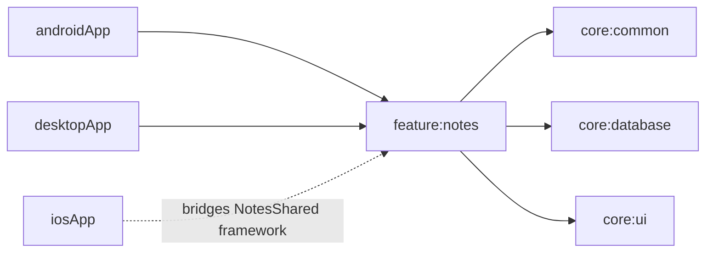
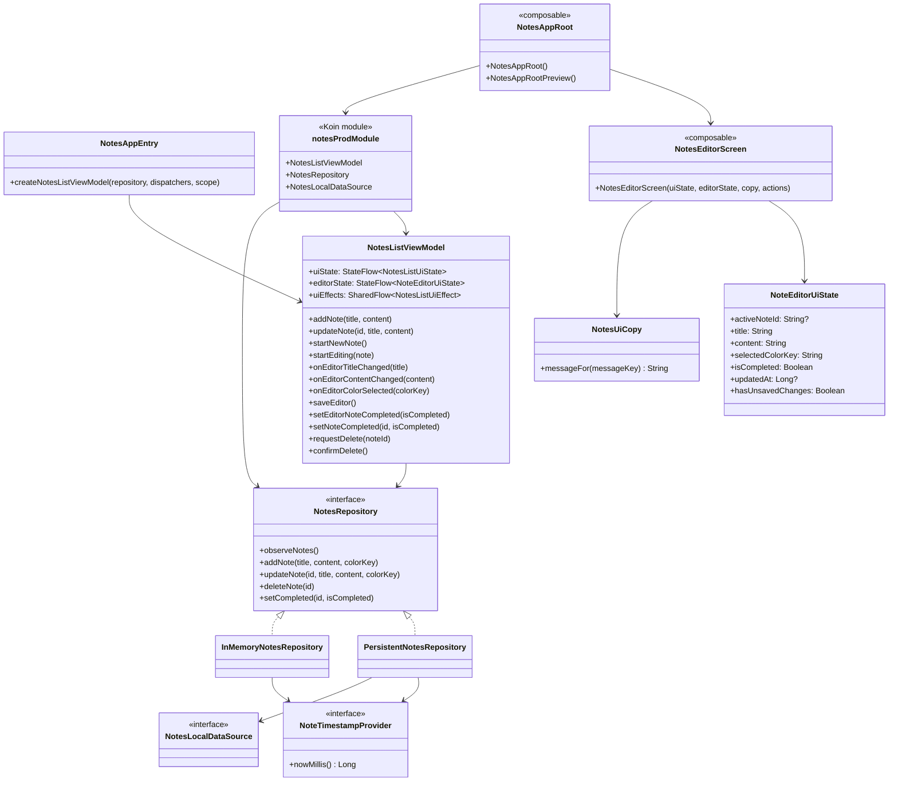
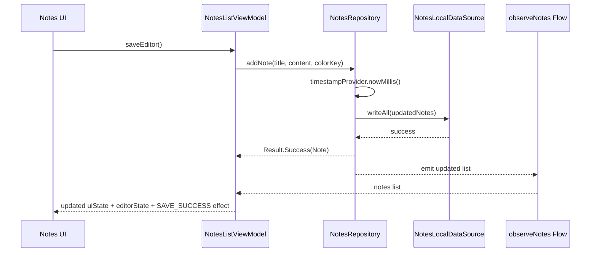
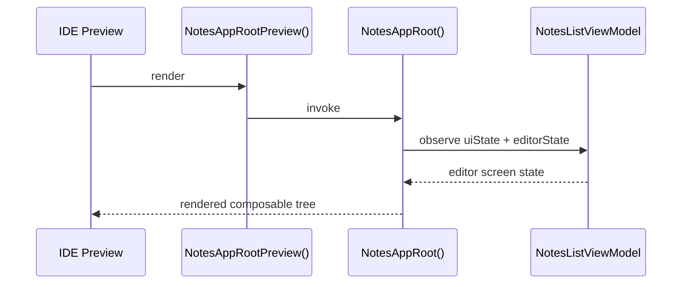

# feature:notes Architecture

## Module Dependency Diagram

## Class Diagram

## Sequence Diagram

## Preview Flow

## Quality Tasks
- Run module formatting with `./gradlew :feature:notes:spotlessCheck`.
- Keep KDoc on repository/viewmodel/screen contracts aligned with behavior changes.
