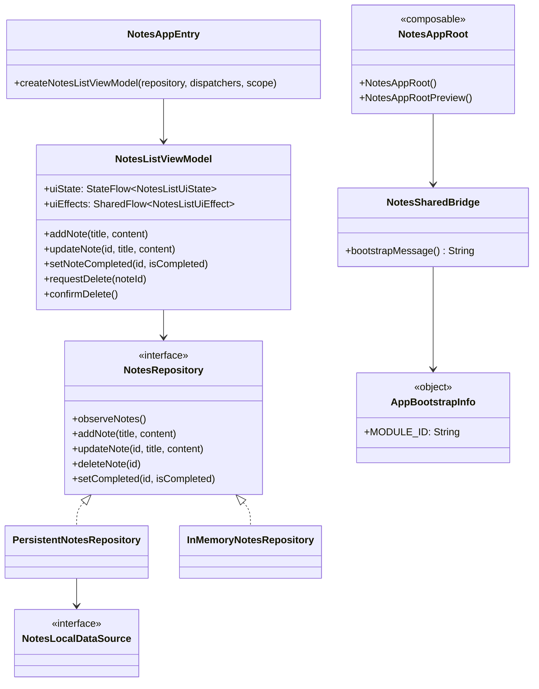
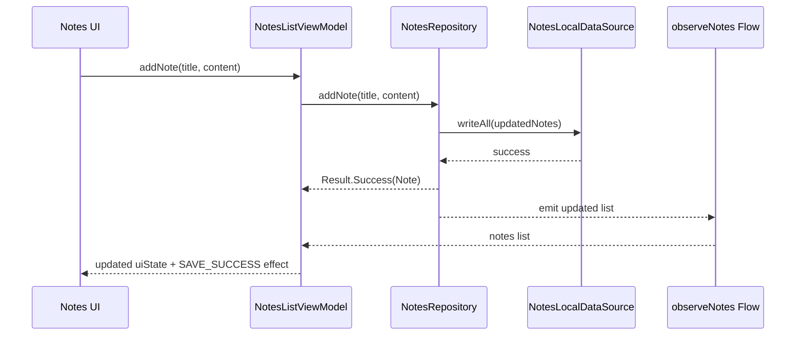
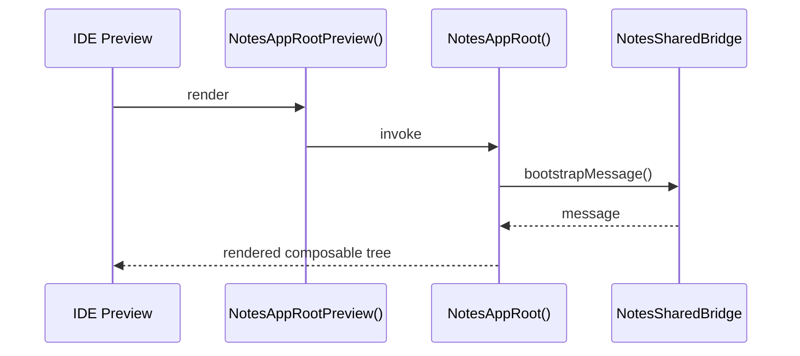

# feature:notes Architecture

## Class Diagram

```mermaid
classDiagram
  class NotesAppEntry {
    +createNotesListViewModel(repository, dispatchers, scope)
  }

  class NotesListViewModel {
    +uiState: StateFlow~NotesListUiState~
    +uiEffects: SharedFlow~NotesListUiEffect~
    +addNote(title, content)
    +updateNote(id, title, content)
    +setNoteCompleted(id, isCompleted)
    +requestDelete(noteId)
    +confirmDelete()
  }

  class NotesRepository {
    <<interface>>
    +observeNotes()
    +addNote(title, content)
    +updateNote(id, title, content)
    +deleteNote(id)
    +setCompleted(id, isCompleted)
  }

  class PersistentNotesRepository
  class InMemoryNotesRepository
  class NotesLocalDataSource {
    <<interface>>
  }

  class NotesSharedBridge {
    +bootstrapMessage() String
  }

  class NotesAppRoot {
    <<composable>>
    +NotesAppRoot()
    +NotesAppRootPreview()
  }

  class AppBootstrapInfo {
    <<object>>
    +MODULE_ID: String
  }

  NotesAppEntry --> NotesListViewModel
  NotesListViewModel --> NotesRepository
  NotesRepository <|.. PersistentNotesRepository
  NotesRepository <|.. InMemoryNotesRepository
  PersistentNotesRepository --> NotesLocalDataSource
  NotesAppRoot --> NotesSharedBridge
  NotesSharedBridge --> AppBootstrapInfo
```

## Sequence Diagram

```mermaid
sequenceDiagram
  participant UI as Notes UI
  participant VM as NotesListViewModel
  participant Repo as NotesRepository
  participant Local as NotesLocalDataSource
  participant Flow as observeNotes Flow

  UI->>VM: addNote(title, content)
  VM->>Repo: addNote(title, content)
  Repo->>Local: writeAll(updatedNotes)
  Local-->>Repo: success
  Repo-->>VM: Result.Success(Note)
  Repo-->>Flow: emit updated list
  Flow-->>VM: notes list
  VM-->>UI: updated uiState + SAVE_SUCCESS effect
```

## Preview Flow

```mermaid
sequenceDiagram
  participant IDE as IDE Preview
  participant Preview as NotesAppRootPreview()
  participant Root as NotesAppRoot()
  participant Bridge as NotesSharedBridge

  IDE->>Preview: render
  Preview->>Root: invoke
  Root->>Bridge: bootstrapMessage()
  Bridge-->>Root: message
  Root-->>IDE: rendered composable tree
```

## Quality Tasks
- Run module formatting with `./gradlew :feature:notes:spotlessCheck`.
