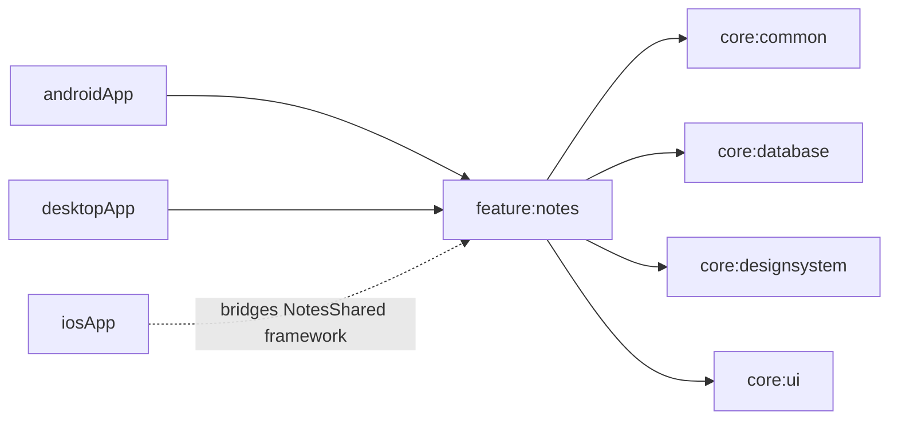

# feature:notes

## Purpose
Notes feature domain/data/presentation logic for note editing, list management, CRUD, filtering, searching, completion state, and note color selection.

## Public Contracts
- `Note`, `NoteColorKeys`, and `NoteFilter` domain models.
- `NotesRepository` repository contract.
- `NoteTimestampProvider` timestamp source for repository mutation times.
- `NotesListViewModel`, `NotesListUiState`, `NoteEditorUiState`, and `NotesListUiEffect`.
- `notesProdModule`, `notesTestModule`, `notesFakeModule` for Koin wiring.
- `NotesAppRoot()` shared Compose root.
- `NotesEditorScreen()` shared Compose editor UI.
- `NotesUiCopy` copy holder for user-facing editor/list strings.
- `makeNotesViewController()` iOS `UIViewController` bridge for shared Compose UI.

## Dependencies
- `core:common`
- `core:database`
- `core:designsystem`
- `core:ui`
- `compose-runtime`, `compose-foundation`, `compose-material3`, `compose-ui`
- `compose-ui-tooling-preview` (commonMain preview annotation support)
- `compose-ui-tooling` (androidMain preview tooling support)
- `kotlinx-coroutines-core`
- `koin-core`

## Module Dependency Diagram

## Usage Notes
- UI should observe `uiState` and `uiEffects` from `NotesListViewModel`.
- Editor UI should observe `editorState` from `NotesListViewModel` and save through `saveEditor()`.
- Editor actions expose search, completion filters, active-note completion, and confirmed deletion through `NotesListViewModel`.
- New and updated notes carry a `colorKey` from `NoteColorKeys`; unsupported values fall back to lavender.
- New and updated notes store `createdAt`/`updatedAt` as epoch milliseconds; older counter-style values still render as legacy labels.
- Delete must be user-confirmed by `requestDelete` then `confirmDelete`.
- Filtering and search are stateful and retained in the view model state.
- Production repository is file-backed through `NotesLocalDataSource`; tests/fakes can still use `InMemoryNotesRepository`.
- `NotesAppRoot()` resolves production wiring through `notesProdModule` and renders the shared editor screen for Android, iOS, and desktop.
- `NotesEditorScreen()` uses icon-first editor chrome and keeps search/filter/recent notes below the editor body.
- Editor colors, typography, spacing, shapes, and motion come from `core:designsystem` through `NotesTheme`.
- `NotesAppRoot()` includes `NotesAppRootPreview()` for Compose preview in IDE.
- Core contracts/classes (`NotesRepository`, repositories, `NotesListViewModel`, and `NotesAppRoot`) include KDoc.
- Module-level format tasks are available: `:feature:notes:spotlessCheck` and `:feature:notes:spotlessApply`.

## Architecture Docs
- [ARCHITECTURE.md](ARCHITECTURE.md)

## Fake/Mock Notes
- Use `notesFakeModule` or `notesTestModule` to inject `InMemoryNotesRepository` and test dispatchers.

## ProGuard/R8 Notes
- N/A for PR1 (no Android packaging rules added yet).
