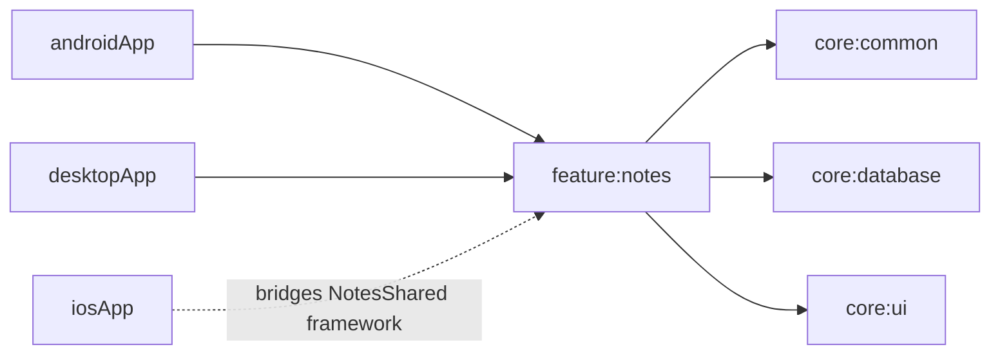

# feature:notes

## Purpose
Notes feature domain/data/presentation logic for list management, CRUD, filtering, searching, and completion state handling.

## Public Contracts
- `Note` / `NoteFilter` domain models.
- `NotesRepository` repository contract.
- `NotesListViewModel`, `NotesListUiState`, and `NotesListUiEffect`.
- `notesProdModule`, `notesTestModule`, `notesFakeModule` for Koin wiring.
- `notesAppRoot()` shared Compose root.
- `makeNotesViewController()` iOS `UIViewController` bridge for shared Compose UI.

## Dependencies
- `core:common`
- `core:database`
- `core:ui`
- `compose-runtime`, `compose-foundation`, `compose-material3`, `compose-ui`
- `kotlinx-coroutines-core`
- `koin-core`

## Module Dependency Diagram

## Usage Notes
- UI should observe `uiState` and `uiEffects` from `NotesListViewModel`.
- Delete must be user-confirmed by `requestDelete` then `confirmDelete`.
- Filtering and search are stateful and retained in the view model state.
- Production repository is file-backed through `NotesLocalDataSource`; tests/fakes can still use `InMemoryNotesRepository`.

## Architecture Docs
- [ARCHITECTURE.md](ARCHITECTURE.md)

## Fake/Mock Notes
- Use `notesFakeModule` or `notesTestModule` to inject `InMemoryNotesRepository` and test dispatchers.

## ProGuard/R8 Notes
- N/A for PR1 (no Android packaging rules added yet).
