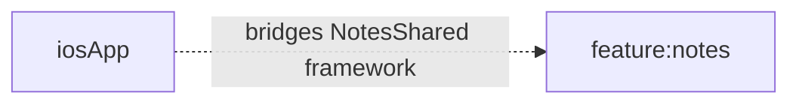

# iosApp

## Purpose
iOS app entry scaffold for Xcode integration.

## Public Contracts
- SwiftUI app entry: `NotesIOSApp`

## Dependencies
- Consumes `feature:notes` shared KMP framework (`NotesShared`) through Xcode script phase.

## Module Dependency Diagram

## Usage Notes
- Build from Gradle with `./gradlew :iosApp:buildIosSimulatorApp`.
- Open `iosApp.xcodeproj` and run scheme `iosApp` in Simulator.
- `ContentView` bridges into Kotlin via `makeNotesViewController()` and renders shared Compose UI.

## Architecture Docs
- [ARCHITECTURE.md](ARCHITECTURE.md)

## Fake/Mock Notes
- iOS DI/test wiring for full UI flow is deferred to the feature PR.

## ProGuard/R8 Notes
- N/A for iOS.
