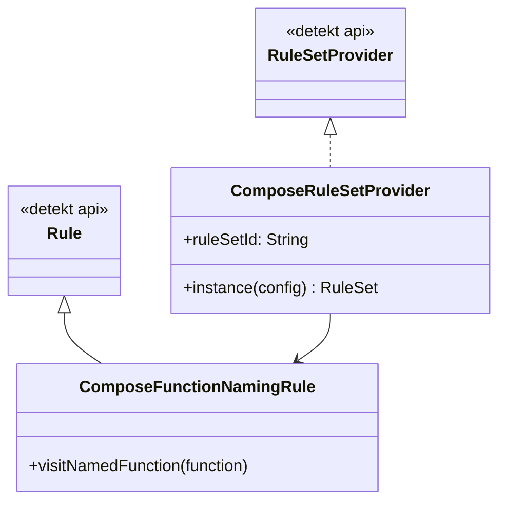
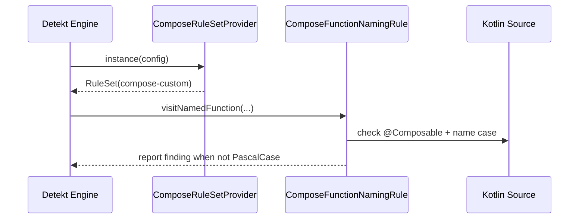

# tools:detekt-rules Architecture

## Class Diagram

```mermaid
classDiagram
  class ComposeRuleSetProvider {
    +ruleSetId: String
    +instance(config) RuleSet
  }

  class ComposeFunctionNamingRule {
    +visitNamedFunction(function)
  }

  class RuleSetProvider {
    <<detekt api>>
  }

  class Rule {
    <<detekt api>>
  }

  RuleSetProvider <|.. ComposeRuleSetProvider
  Rule <|-- ComposeFunctionNamingRule
  ComposeRuleSetProvider --> ComposeFunctionNamingRule
```

## Sequence Diagram

```mermaid
sequenceDiagram
  participant Detekt as Detekt Engine
  participant Provider as ComposeRuleSetProvider
  participant Rule as ComposeFunctionNamingRule
  participant Kotlin as Kotlin Source

  Detekt->>Provider: instance(config)
  Provider-->>Detekt: RuleSet(compose-custom)
  Detekt->>Rule: visitNamedFunction(...)
  Rule->>Kotlin: check @Composable + name case
  Rule-->>Detekt: report finding when not PascalCase
```

## Quality Tasks
- Run module formatting with `./gradlew :tools:detekt-rules:spotlessCheck`.
