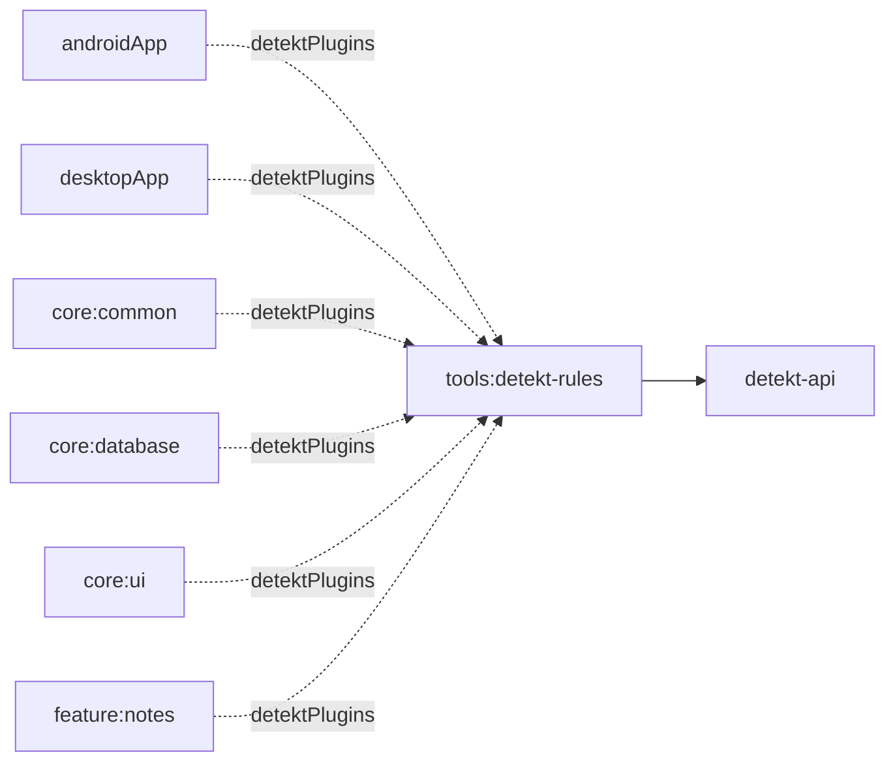

# tools:detekt-rules

## Purpose
Custom Detekt rules used by this repository to enforce Compose-specific static analysis behavior.

## Public Contracts
- `ComposeRuleSetProvider` rule set registration (`compose-custom`).
- `ComposeFunctionNamingRule` enforces PascalCase for `@Composable` function names.

## Dependencies
- `io.gitlab.arturbosch.detekt:detekt-api`
- `io.gitlab.arturbosch.detekt:detekt-test` (tests)

## Module Dependency Diagram

## Usage Notes
- Rule set id: `compose-custom`.
- Rule id: `ComposeFunctionNaming`.
- Enabled from `/Users/stephensiapno/IdeaProjects/projects/note/config/detekt/detekt.yml`.
- Module-level format tasks are available: `:tools:detekt-rules:spotlessCheck` and `:tools:detekt-rules:spotlessApply`.

## Architecture Docs
- [ARCHITECTURE.md](ARCHITECTURE.md)

## Fake/Mock Notes
- N/A.

## ProGuard/R8 Notes
- N/A.
